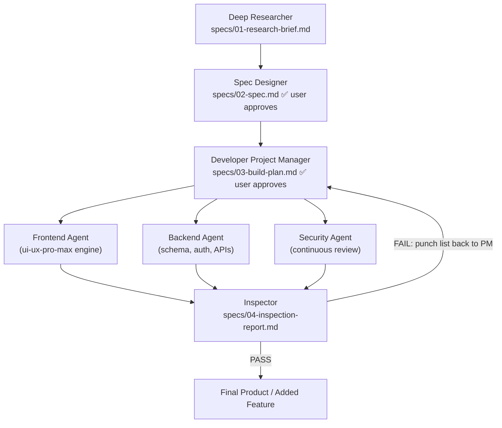

# Build Pipeline Reference

## Phase summary

1. **Deep Researcher** turns a rough idea into a grounded brief: problem, users, codebase findings (for features), prior art, recommended building blocks, risks, open questions.
2. **Spec Designer** turns the brief into a contract: scope in/out, EARS requirements (numbered FR-x), Given/When/Then acceptance criteria, error handling table, NFRs. User approves.
3. **Developer Project Manager** picks the stack (new projects), designs architecture and the integration contract, writes three work orders (frontend/backend/security) and the build sequence. User approves. Then coordinates the build.
4. **Build tracks** run under the PM: backend first (schema → auth → endpoints), frontend against the contract (design system generated by ui-ux-pro-max before any UI code), security reviewing as code lands. Critical security findings stop the line.
5. **Inspector** verifies: does it run, is every requirement and acceptance criterion satisfied, code review with confidence ≥ 80 filtering, React performance rules where relevant. FAIL loops a punch list back to the PM; PASS delivers.

## Design principles

- Research before spec, spec before plan, plan before code. Skipping ahead is how one-shot builds miss.
- Two human checkpoints, then autonomy. Questions after plan approval only when the spec is silent and the choice is user-visible.
- One contract for integration. Frontend and backend build to the same declared routes and types, so parallel work converges.
- Verification is adversarial. The Inspector runs the product and exercises the criteria; it does not take the builders' word.
- Scope creep goes to `specs/backlog.md`, not into the build.
- Git is part of the pipeline, not an afterthought: feature branches per run, Conventional Commits per work-order task referencing FR numbers, `main` only moves on inspection PASS. Full rules in `.claude/skills/git-workflow/`.
